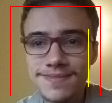

# Práctica 6 - Procesamiento de vídeo


## Memoria

### Autor

Kevin David Rosales Santana - <kevin.rosales101@alu.ulpgc.es>

### Índice

1. [Introducción](#1-introducción)
2. [Muestra del resultado](#2-muestra-del-resultado)
3. [Descripción del trabajo realizado](#3-descripción-del-trabajo-realizado)

   3.1 [Estructura de ficheros](#31-estructura-de-ficheros)
   
   3.2 [Decisiones en el desarrollo](#32-decisiones-en-el-desarrollo)
   
      - 3.2.1 [Detección facial y de ojos](#321-detección-facial-y-de-ojos)
      - 3.2.2 [Efecto "cabeza invertida"](#322-efecto-cabeza-invertida)
      - 3.2.3 [Efecto "caminante blanco"](#323-efecto-caminante-blanco)
      - 3.2.4 [Efecto "artista"](#324-efecto-artista)
      - 3.2.5 [Efecto "detective"](#325-efecto-detective)
   
4. [Conclusión](#4-conclusión)
5. [Ejecución del Proyecto](#5-ejecución-del-proyecto)
6. [Referencias y herramientas utilizadas](#6-referencias-y-herramientas-utilizadas)

### 1. Introducción

En la presente práctica se pedía implementar un **prototipo de combinación de salida gráfica en respuesta a una captura de vídeo**, sirviendo para el aprendizaje de *Processing*, el cual tiene como objetivo facilitar los desarrollos con fines creativos en entornos digitales. 

En este repositorio **se tiene la implementación de cuatro prototipos distintos que consisten en cuatro efectos de vídeo**, los cuales son:

- [Efecto de "cabeza invertida"](#322-efecto-cabeza-invertida)
- [Efecto de "caminante-blanco"](#323-efecto-caminante-blanco)
- [Efecto de "artista"](#324-efecto-artista)
- [Efecto de detective"](#325-efecto-detective)

Además, se tiene que todos los efectos hacen uso, de una manera u otra de [una detección facial o de una detección de ojos](#321-detección-facial-y-de-ojos).

### 2. Muestra del resultado

|  |  |
| -------------------------------------- | -------------------------------------- |
|  |  |

<div align="center">
   <p>Tabla 1: Muestra de resultados</p>
</div>

### 3. Descripción del trabajo realizado

#### 3.1 Estructura de ficheros

Para realizar este trabajo, se han creado estos dos ficheros (presentes en la carpeta [Practica6](Practica6/)):

| Fichero         | Descripción                                                  |
| :-------------- | :----------------------------------------------------------- |
| *Practica6.pde* | Fichero encargado de la **interfaz gráfica** del proyecto. Además, al ser el fichero principal, gestiona el `setup()` y el `draw()` del proyecto haciendo uso de las utilidades [*utils.pde*](Practica6/utils.pde) de este. Es el encargado de cambiar entre los distintos efectos haciendo uso de eventos de teclado y de dibujar la información en la esquina superior izquierda. Por último, se encarga de gestionar la cámara que usa el sistema. |
| *utils.pde*     | Conjunto de **utilidades**. Administra las detecciones faciales y de ojos, además de construir las imágenes resultantes de los distintos efectos usados. |

<div align="center">
   <p>Tabla 2: Estructura de ficheros</p>
</div>

#### 3.2 Decisiones en el desarrollo

A la hora de realizar los distintos efectos se ha tenido que tomar una serie de decisiones respecto al desarrollo del proyecto. A continuación, se listarán dichas decisiones:

##### 3.2.1 Detección facial y de ojos

Para la detección facial y de ojos se ha utilizado **el repositorio proporcionado para las prácticas de CIU** [(ver referencia 5)](#6-referencias-y-herramientas-utilizadas). Concretamente, se ha utilizado el presente en la carpeta de la práctica 6 [*p6_camviola*](https://github.com/otsedom/CIU/tree/master/P6/p6_camviola/data) y se ha modificado levemente para este proyecto. Se puede encontrar más información de dicho detector de caras en la página 122 de la [referencia 1](#6-referencias-y-herramientas-utilizadas). Dicho detector fue mejorado para detectar ojos por parte del profesorado de la EII ([ver referencia 6](#6-referencias-y-herramientas-utilizadas)).

Gracias a dicha detección facial y de ojos, se pudieron desarrollar los 4 efectos que se verán a continuación.

Además, sobre dicha detección se extrajo unas dimensiones de la cara distintas a las propuestas para algunos de los efectos que a continuación se describirán. La **rectángulo rojo** es la detección que ofrece el módulo del repositorio de CIU mientras que el **rectángulo amarillo** contiene la detección utilizada en el [efecto de "cabeza invertida"](#322-efecto-cabeza-invertida) y en el [efecto de detective"](#325-efecto-detective):



<div align="center">
   <p>Figura 1: Comparación de dimensiones de rostros escogidas</p>
</div>


##### 3.2.2 Efecto "cabeza invertida"

**El efecto de "cabeza invertida"** consiste en detectar la cara del individuo para a continuación girarla 180º. Para realizar esta acción, es necesario adaptar el tamaño de la cara detectada para que, empezando desde la frente del individuo (donde se situaría la nueva boca) se acabe en la nariz.

Se debe destacar que al situar el nuevo fragmento de imagen al revés, se debe realizar un `scale(-1,-1)` para luego calcular los nuevos tamaños teniendo en cuenta esta situación. Además, se le da la vuelta a la imagen en el eje `y` con el objetivo de que al rotar la cabeza hacia los lados, la imagen superpuesta también se dirija en dicha dirección (ver *Figura 2*).

```java
ArrayList[] detectFacesAndEyes(Mat grey, float pupilRadius, float irisRadius) {
  	[...]
  	ArrayList<float[]> facesToReverse = new ArrayList();
  	[...]
    
    for (Rect r : facesArr) {
        [...]
        facesToReverse.add(new float[]{r.x+(int)(r.width*0.175), r.y+(int)(r.height*0.25), r.width*0.7, r.height*0.65});
    	[...]
    }
    [...]
}

void reverseFace(CVImage faceImg, float[] face) {
  	pushMatrix();
  	scale(-1, -1);
  	image(faceImg, -face[0]*.965, -face[1]+face[3]/4, -face[2]*1.1, -face[3]*0.9);
  	popMatrix();
}
```

<div align="center">
   <p>Fragmento de código 1: Construcción del efecto de "cabeza invertida"</p>
</div>


<div align="center">
    <p>Figura 2: Muestra de efecto <i>cabeza invertida</i></p>
</div>


##### 3.2.3 Efecto "caminante blanco"

**El efecto de "caminante blanco"** se realiza detectando la posición de los ojos. Tras obtener tener el rectángulo que contiene al ojo, se calcula punto medio del área de dicho rectángulo. A la hora de dibujar los ojos, se rellena un círculo externo azul representando el iris y un círculo interno en negro representando a la pupila.

Lo interesante de la implementación en este caso es que para calcular el radio de ambos círculos se tiene **en cuenta la proporcionalidad de los rectángulos de los ojos** (que suele ser relativamente constante) **respecto a la proporcionalidad de toda la cara**. 

```java
ArrayList[] detectFacesAndEyes(Mat grey, float pupilRadius, float irisRadius) {
    [...]
    for (Rect r : facesArr) {
        [...]
    	if (mode != 2){
      		for (Rect rl : leyesArr) {
        		eyesToDraw.add(new float[]{rl.x+r.x+(rl.height/2), rl.y+r.y+(rl.width/2), (pupilRadius + irisRadius)*((r.height*r.width)/(rl.height*rl.width*17.5)), (pupilRadius)*((r.height*r.width)/(rl.height*rl.width*17.5))});
    		}
        }
        
    	[...]
        
    	if (mode != 2){
      		for (Rect rl : reyesArr) {
        		eyesToDraw.add(new float[]{rl.x+r.x+(int)(r.width*0.3)+(rl.height/2), rl.y+r.y+(rl.width/2), (pupilRadius + irisRadius)*((r.height*r.width)/(rl.height*rl.width*17.5)), (pupilRadius)*((r.height*r.width)/(rl.height*rl.width*17.5))});
      		}
    	}
    }
}

void drawEyes(float[] eye) {
  noStroke();
  fill(0, 162, 255);
  [...]
  else circle(eye[0], eye[1], eye[2]);

  fill(0, 0, 0);
  [...]
  else circle(eye[0], eye[1], eye[3]);
  noFill();
}
```

<div align="center">
   <p>Fragmento de código 2: Cálculo de centros y de radios de los ojos para su posterior dibujado </p>
</div>


<div align="center">
    <p>Figura 3: Muestra de efecto <i>caminante blanco</i></p>
</div>


##### 3.2.4 Efecto "artista"

Respecto al **efecto "artista"** (posiblemente el más interactivo), se propone al usuario la capacidad de poder **dibujar usando la posición de sus ojos** en su respectiva detección.

Para realizar este efecto (teniendo en cuenta que puede suceder que los dos ojos no se detecten a la vez), se decidió **recoger la posición del ojo izquierdo para a continuación desplazarlo en `x`** para ponerlo sobre la nariz del usuario de forma aproximada. Evidentemente, se elimina cualquier tipo de imagen de la cámara con el fin de que el usuario pueda concentrarse exclusivamente en el dibujo.

Además, se modificó levemente el código de dibujado de ojos, diseñando que los ojos se pintaran **en un modo espejo en el eje `x`**. Si esta acción no se realizara (sabiendo que la cámara está mirando al usuario), cuando el usuario tratase de dibujar sobre la pantalla desplazándose hacia la derecha, lo vería representado en un dibujo que se desplaza hacia la izquierda.

```java
ArrayList[] detectFacesAndEyes(Mat grey, float pupilRadius, float irisRadius) {
    [...]
    for (Rect r : facesArr) {
		[...]
		
		if (mode == 2){
      		for (Rect rl : leyesArr){
        		eyesToDraw.add(new float[]{rl.x+r.x+(rl.height/2)+(int)(r.width*0.15), rl.y+r.y+(rl.width/2), (pupilRadius + irisRadius)*((r.height*r.width)/(rl.height*rl.width*17.5)), (pupilRadius)*((r.height*r.width)/(rl.height*rl.width*17.5))});
      		}
    	}
    	
		[...]
    }
}

void drawEyes(float[] eye) {
  noStroke();
  fill(0, 162, 255);
  if (mode == 2) circle(cam.width-eye[0], eye[1], eye[2]);
  [...]

  fill(0, 0, 0);
  if (mode == 2) circle(cam.width-eye[0], eye[1], eye[3]);
  [...]
  noFill();
}
```

<div align="center">
   <p>Fragmento de código 3: Cálculo de la posición del ojo izquierdo con desplazamiento hacia el centro del rostro para su posterior dibujado </p>
</div>


<div align="center">
   <p>Figura 4: Muestra de efecto <i>artista</i></p>
</div>

##### 3.2.5 Efecto "detective"

Como último efecto, se propone para construir **el efecto "detective"** que haciendo uso de las técnicas usadas en el [efecto de "cabeza invertida"](#322-efecto-cabeza-invertida) (aunque en esta ocasión sin girar 180º el rostro), se dibujen las zonas pertenecientes a los ojos del usuario en su frente y boca. 

La diferencia es que en esta ocasión, se hace uso **de efectos visuales**. Concretamente, se hace uso de los efectos presentes en el repositorio de la asignatura ([referencia 5](#6-referencias-y-herramientas-utilizadas)):

- *canny*  ([p6_camcanny](https://github.com/otsedom/CIU/tree/master/P6/p6_camcanny)) para la parte inferior de la cara.
- *sobel* ([p6_camsobel](https://github.com/otsedom/CIU/tree/master/P6/p6_camsobel)) para la parte superior de la cara.

```java
void faceSobelAndCanny(CVImage faceImg, float[] face) {
  [...]

  Imgproc.Canny(gris, gris, 20, 60, 3);

  cpMat2CVImage(gris, auxImg);

  image(auxImg, face[0], face[1]+face[3]/2, face[2]*1.1, face[3]*0.75);
  
  gris = img.getGrey();
    
  [...]

  cpMat2CVImage(gris, auxImg);

  image(auxImg, face[0], face[1]-face[3]/2, face[2]*1.1, face[3]*0.5);
  
  gris.release();
  popMatrix();
}
```

<div align="center">
   <p>Fragmento de código 4: Generación y dibujado de efectos <i>canny</i> y <i>sobel</i></p>
</div>


<div align="center">
   <p>Figura 4: Muestra de efecto <i>detective</i></p>
</div>

### 4. Conclusión

Esta práctica ha servido una vez más como aprendizaje para *Processing* y, además, se ha tratado de una práctica muy entretenida donde se ha tenido contacto con una herramienta que sirve para aprender **diferentes formas de realizar salidas gráficas en respuestas a capturas de vídeos.**

*Processing* para ello otorga una serie de funciones muy útiles y con cometidos muy distintos que permiten realizar tareas tan variadas como la que se puede observar en este repositorio. Se ha podido observar cómo el uso de ***opencv*** ([ver referencia 7](#6-referencias-y-herramientas-utilizadas)) **resulta fundamental a la hora de detectar caras o de realizar algunos de los efectos expuestos en esta práctica. **

Por último, se debe recalcar que gracias a esta sexta práctica de *Creando Interfaces de Usuario*, se ha podido aprender desarrollar una práctica donde la interactividad **reside en los propios gestos del usuario**, **siendo este tipo de acciones una de las que más se encuentra en auge actualmente en el mundo del la visión por computador.**

### 5. Ejecución del proyecto

Para ejecutar este proyecto, es necesario:

- Tener instalado [Processing (Referencia 3)](#6-referencias-y-herramientas-utilizadas)
- Tener instalado la librería *Video*, de *The Processing Foundation* [(ver página 111 de la Referencia 1)](#6-referencias-y-herramientas-utilizadas)
- Tener instalado *OpenCV 4.0.0* para *Processing 3.0* ([Referencia 8](#6-referencias-y-herramientas-utilizadas))

Para ejecutar el proyecto, tan solo se debe abrir el fichero [Practica6.pde](Practica6/Practica6.pde) y darle al botón de ejecutar.

**Nota importante**: se debe disponer de algún dispositivo de entrada de vídeo.

**Consejo:** debería probarse este proyecto bajo unas condiciones de luminosidad y calidad de vídeo óptimas para una mejor experiencia.

Se recuerda que como dice la información por pantalla, el cambio de efecto de vídeo se realiza con la tecla `ENTER`.

### 6. Referencias y herramientas utilizadas

- [1] Modesto Fernando Castrillón Santana, José Daniel Hernández Sosa. [Creando Interfaces de Usuario. Guion de Prácticas](https://cv-aep.ulpgc.es/cv/ulpgctp20/pluginfile.php/126724/mod_resource/content/25/CIU_Pr_cticas.pdf)
- [2] Processing Foundation. [Processing Reference.](https://processing.org/reference/)
- [3] Processing Foundation. [Processing Download.](https://processing.org/download/)
- [4] Extrapixel. [GifAnimation Processing Library.](https://github.com/extrapixel/gif-animation)
- [5] Modesto Fernando Castrillón Santana. [Repositorio de las prácticas de CIU.](https://github.com/otsedom/CIU)
- [6] Modesto Castrillón, Oscar Déniz, Daniel Hernández, and Javier Lorenzo. A comparison of face and facial feature detectors based on the violajones general object detection framework. Machine Vision and Applications, 22(3):481–494, 2011
- [7] OpenCV team. [Open CV](https://opencv.org/)
- [8] Bryan Chung. [OpenCV 4.0.0 Java Built and CVImage library](http://www.magicandlove.com/blog/2018/11/22/opencv-4-0-0-java-built-and-cvimage-library/).
